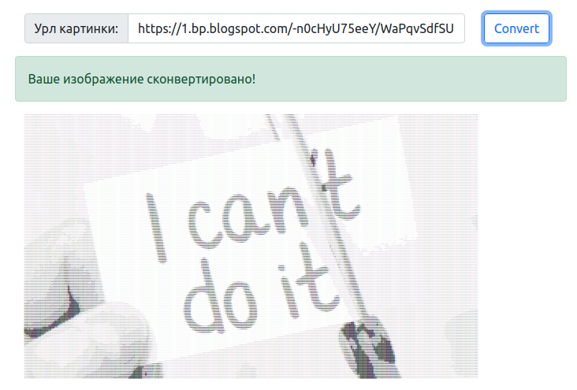

# Конвертер в текстовую графику

Вас пригласили поучаствовать в разработке приложения, умеющего скачивать картинки по URL и конвертировать изображения в текстовую графику (т. е. текст из разных символов, которые в совокупности выглядят как изображение). Вот пример его работы (картинка на нём — это текст из мелких символов):



Так как вы лишь участник проекта, у вас нет полной свободы действий в выборе архитектуры программы: класс сервера уже написан, он умеет работать с интерфейсом конвертера (будет описан ниже), вам же нужно дать интерфейсам реализацию.

Первым делом [скачайте проект задания](https://github.com/netology-code/java-homeworks/raw/master/diploma/javabasicsdiploma.zip), разархивируйте архив с проектом и откройте его в IntelliJ IDEA (File -> Open -> выберите скачанную папку). Открытый проект должен отображаться без ошибок компиляции, если же у вас подчёркивает что-то красным, убедитесь что к проекту подключена Java (если нет, то должна быть надпись "Project JDK is not defined", нажимаете рядом на "Setup JDK" и выбираете джаву 11ю версию джавы). Если всё равно горит красным, попробуйте File -> Invalidate Caches / Restart. Если и это не помогает - пишите вашему руководителю, поможем настроить!

Если вы запустите `Main` в его изначальном виде, то программа упадёт с `NullPointerException`, потому что объект сервера хочет получить объект нужного интерфейса, класс которого вам и предстоит реализовать.

В папке assets менять ничего нельзя, там лежит реализация страницы приложения. В папке src лежит исходный код приложения. Никакие существующие интерфейсы и классы кроме `Main` менять нельзя, только добавлять свои.

## Общая схема конвертации

Общая схема конвертации будет соответствовать следующей последовательности действий (они подробнее описаны ниже):
1. Скачиваем картинку по URL;
2. Менеджеру могли выставить максимально допустимое соотношение сторон (ширины и высоты); если оно слишком большое, то конвертация не делается и выбрасывается исключение;
3. При конвертации мы будем менять каждый пиксель на символ: чем пиксель темнее, тем «жирнее» символ, который мы подставим. Менеджеру могли выставить максимальные ширину и высоту итоговой картинки, при этом если исходная картинка больше, то нам надо уменьшить её размер, соблюдая пропорции;
4. Превращаем цветное изображение в чёрно-белое (чтобы мы смотрели только на интенсивность цвета, а не подбирали для красного одни символы, для зелёного другие и т. п);
1. Перебираем все пиксели изображения, спрашивая у них степень белого (число от 0 до 255, где 0 — это чёрный, а 255 — это светлый). В зависимости от этого числа выбираем символ из заранее подготовленного набора;
1. Собираем все полученные символы в единую строку, отдаём как результат конвертации.

## Конвертер
Самый главный интерфейс, реализацию которого отдельным классом вам надо сделать, это `ru.netology.graphics.image.TextGraphicsConverter`. В нём есть набор методов, задающих настройки конвертера:
- Можно установить максимально допустимое соотношение сторон (ширины и высоты); если метод не вызывали, то любое соотношение допустимо;
- Можно установить максимально допустимую высоту итогового изображения; если метод не вызывали, то любая высота допустима;
- Можно установить максимально допустимую ширину итогового изображения; если метод не вызывали, то любая ширина допустима;
- Можно установить текстовую цветовую схему — объект специального интерфейса, который и будет отвечать за превращение степени белого (числа от 0 до 255) в символ; если метод не вызывали, то должен использоваться объект написанного вами класса как значение по умолчанию.

Главный же метод этого интерфейса — это метод `String convert(String url) throws IOException, BadImageSizeException;`: он принимает URL и возвращает изображение в виде текстовой графики. Давайте разберём схему реализации этого метода:

```java
    @Override
    public String convert(String url) throws IOException, BadImageSizeException {
        // Вот так просто мы скачаем картинку из интернета :)
        BufferedImage img = ImageIO.read(new URL(url));

        // Если конвертер попросили проверять на максимально допустимое
        // соотношение сторон изображения, то вам здесь надо сделать эту проверку,
        // и, если картинка не подходит, выбросить исключение BadImageSizeException.
        // Чтобы получить ширину картинки, вызовите img.getWidth(), высоту - img.getHeight()

        // Если конвертеру выставили максимально допустимые ширину и/или высоту,
        // вам надо по ним и по текущим высоте и ширине вычислить новые высоту
        // и ширину.
        // Соблюдение пропорций означает, что вы должны уменьшать ширину и высоту должны
        // в одинаковое количество раз.
        // Пример 1: макс. допустимые 100x100, а картинка 500x200. Новый размер
        // будет 100x40 (в 5 раз меньше).
        // Пример 2: макс. допустимые 100x30, а картинка 150x15. Новый размер
        // будет 100x10 (в 1.5 раза меньше).
        // Подумайте, какими действиями можно вычислить новые размеры.
        // Не получается? Спросите вашего руководителя по курсовой, поможем!
        int newWidth = ???;
        int newHeight = ???;

        // Теперь нам надо попросить картинку изменить свои размеры на новые.
        // Последний параметр означает, что мы просим картинку плавно сузиться
        // на новые размеры. В результате мы получаем ссылку на новую картинку, которая
        // представляет собой суженную старую.
        Image scaledImage = img.getScaledInstance(newWidth, newHeight, BufferedImage.SCALE_SMOOTH);

        // Теперь сделаем её чёрно-белой. Для этого поступим так:
        // Создадим новую пустую картинку нужных размеров, заранее указав последним
        // параметром чёрно-белую цветовую палитру:
        BufferedImage bwImg = new BufferedImage(newWidth, newHeight, BufferedImage.TYPE_BYTE_GRAY);
        // Попросим у этой картинки инструмент для рисования на ней:
        Graphics2D graphics = bwImg.createGraphics();
        // А этому инструменту скажем, чтобы он скопировал содержимое из нашей суженной картинки:
        graphics.drawImage(scaledImage, 0, 0, null);

        // Теперь в bwImg у нас лежит чёрно-белая картинка нужных нам размеров.
        // Вы можете отслеживать каждый из этапов, просто в любом удобном для
        // вас моменте сохранив промежуточную картинку в файл через:
        // ImageIO.write(imageObject, "png", new File("out.png"));
        // После вызова этой инструкции у вас в проекте появится файл картинки out.png

        // Теперь давайте пройдёмся по пикселям нашего изображения.
        // Если для рисования мы просили у картинки .createGraphics(),
        // то для прохода по пикселям нам нужен будет этот инструмент:
        WritableRaster bwRaster = bwImg.getRaster();

        // Он хорош тем, что у него мы можем спросить пиксель на нужных
        // нам координатах, указав номер столбца (w) и строки (h)
        // int color = bwRaster.getPixel(w, h, new int[3])[0];
        // Выглядит странно? Согласен. Сам возвращаемый методом пиксель — это 
        // массив из трёх интов, обычно это интенсивность красного, зелёного и синего.
        // Но у нашей чёрно-белой картинки цветов нет, и нас интересует
        // только первое значение в массиве. Вы спросите, а зачем 
        // мы ещё параметром передаём интовый массив на три ячейки?
        // Дело в том, что этот метод не хочет создавать его сам и просит
        // вас сделать это, а сам метод лишь заполнит его и вернёт.
        // Потому что создавать массивы каждый раз слишком медленно. Вы можете создать
        // массив один раз, сохранить в переменную и передавать один
        // и тот же массив в метод, ускорив тем самым программу.

        // Вам осталось пробежаться двойным циклом по всем столбцам (ширина)
        // и строкам (высота) изображения, на каждой внутренней итерации
        // получить степень белого пикселя (int color выше) и по ней
        // получить соответствующий символ c. Логикой превращения цвета
        // в символ будет заниматься другой объект, который мы рассмотрим ниже
        for ??? {
          for ??? {
            int color = bwRaster.getPixel(w, h, new int[3])[0];
            char c = schema.convert(color);
            ??? //запоминаем символ c, например, в двумерном массиве или как-то ещё на ваше усмотрение
          }
        }

        // Осталось собрать все символы в один большой текст
        // Для того, чтобы изображение не было слишком узким, рекомендую
        // каждый пиксель превращать в два повторяющихся символа, полученных
        // от схемы.

        return ???; // Возвращаем собранный текст.
    }
```

## Символьная цветовая схема
Мы написали интерфейс конвертера так, чтобы сам он не подбирал каждому цвету определённый символ, но чтобы им занимался другой объект следующего интерфейса:
```java
public interface TextColorSchema {
    char convert(int color);
}
```

Предлагается следующая логика его работы. Вот список символов от самых «тёмных» к самым «светлым»: '▇', '●', '◉', '◍', '◎', '○', '☉', '◌', '-'. Если вы программируете на винде, то рекомендуем другой список из более стандартных символов, иначе может отрисовываться криво: '#', '$', '@', '%', '*', '+', '-', '\''. В зависимости от переданного значения интенсивности белого, должен выбираться соответствующий символ. Например, если значение близко к 0, то выбрать надо '▇'; если к 255, то '-'. Если где-то посередине, то и выбирать надо тоже где-то посередине.

Подумайте, как это можно реализовать. Вы можете сделать это условными операторами, однако есть и решение в одну строчку. Если у вас совсем не получается придумать, как это сделать, спросите вашего руководителя по курсовой.

В итоге у вас должен быть класс, реализующий этот интерфейс. Если объекту конвертера сеттером не передали иную реализацию этого интерфейса, он должен использовать этот ваш класс как реализацию по умолчанию.

## Запуск
Входная точка (класс с запусаемым main-методом) — `ru.netology.graphics.Main`.

Сейчас он настроен так, что создаётся сервер, которому передаётся ваш объект-конвертер. После запуска сервера вы можете открыть в браузере страницу приложения, указать URL картинки и отправить его на обработку. Сервер получит URL, сконвертирует с помощью вашего конвертера изображение и полученный текст отправит пользователю, ожидающему ответ в браузере.

Если вы хотите больше контроля над тем, что происходит, вы можете вместо сервера запускать ваш конвертер так, чтобы его результат сохранялся в обычный текстовый файл. Для этого раскомментируйте соответствующий код в методе `main` (закомментировав строки с сервером). После запуска программы результат работы вашего конвертера будет сохранён в файле converted-image.txt в папке вашего проекта. Откройте его любым текстовым редактором (Блокнот и т. п), но установите в настройках редактора маленький размер шрифта, чтобы что-то было видно.

## Итог
Вы должны реализовать два класса указанных интерфейсов, соблюдая выставленные к ним требования. Если у вас что-то не получается или есть вопросы, пишите вашему руководителю по курсовой. В качестве решения запакуйте ваш проект в архив и прикрепите файл при отправке. Если вы уже овладели работой на гитхабе, то можете разместить проект в публичном репозитории и прикрепить ссылку на него в качестве решения.
Успехов!
